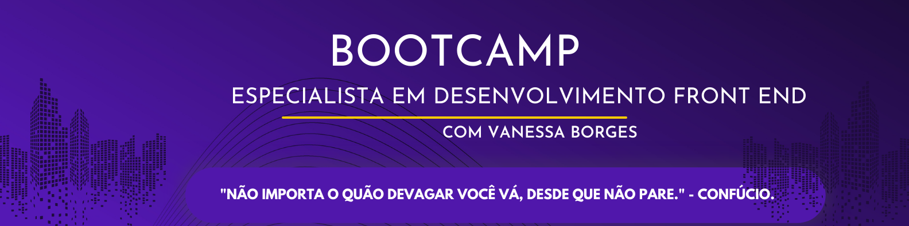

# Bootcamp-front-end-turma-01-mentoria-

 

Bem-vindo ao Bootcamp de Desenvolvimento Front End! Estamos muito animados por você ter se juntado a nós nesta jornada de aprendizado e crescimento na área de desenvolvimento de software.

Ao longo deste bootcamp, você terá a oportunidade de aprender as habilidades e ferramentas essenciais necessárias para se tornar um desenvolvedor front-end de sucesso. Desde a criação de layouts responsivos usando HTML e CSS até a construção de interações dinâmicas e animações usando JavaScript, você estará preparado para enfrentar os desafios do mundo real e construir interfaces incríveis para a web.
